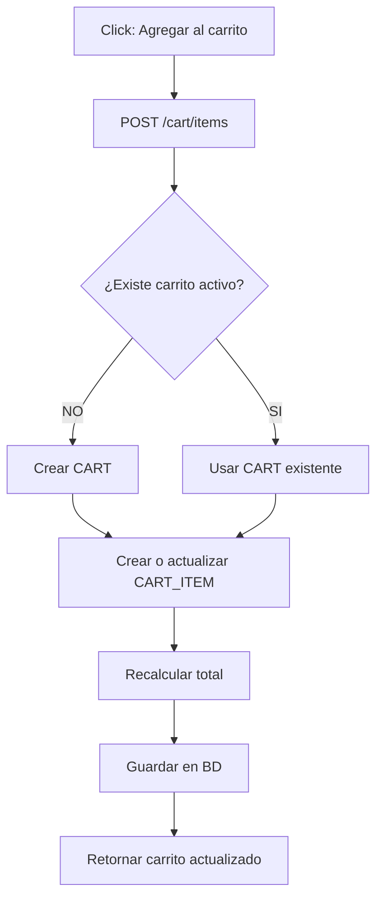
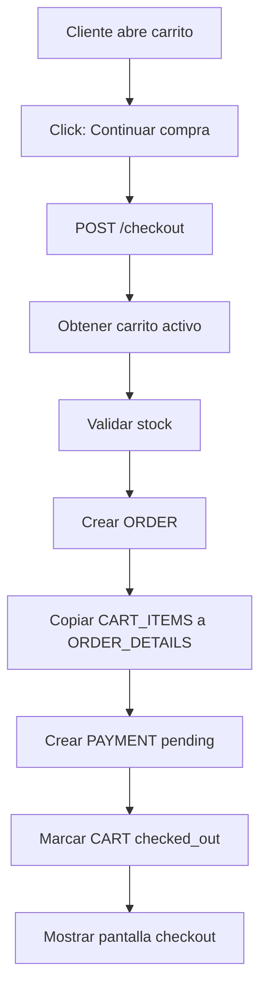
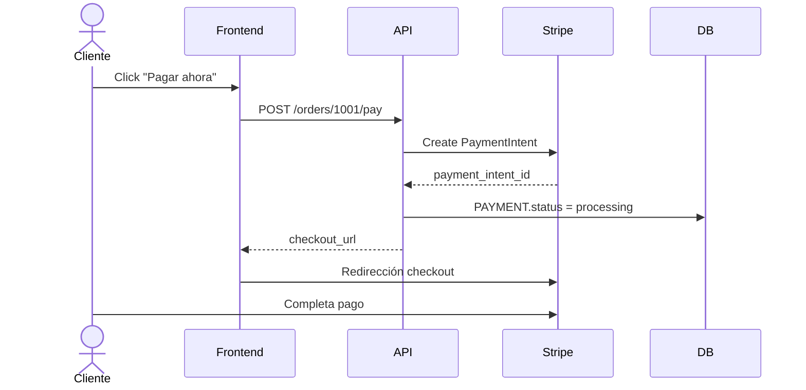
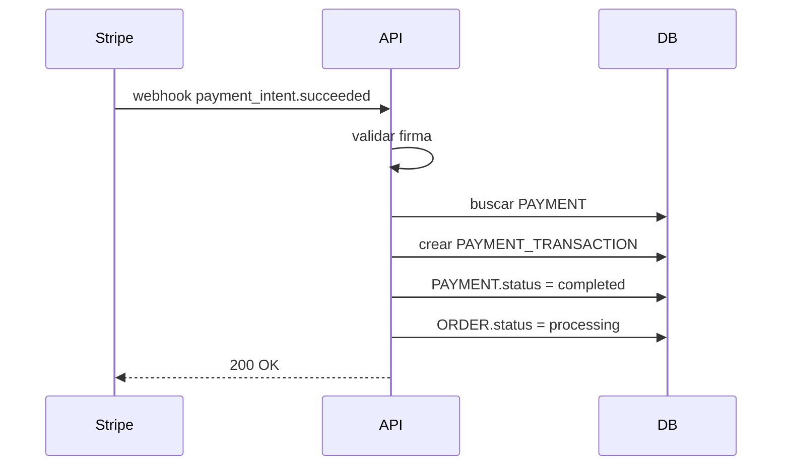
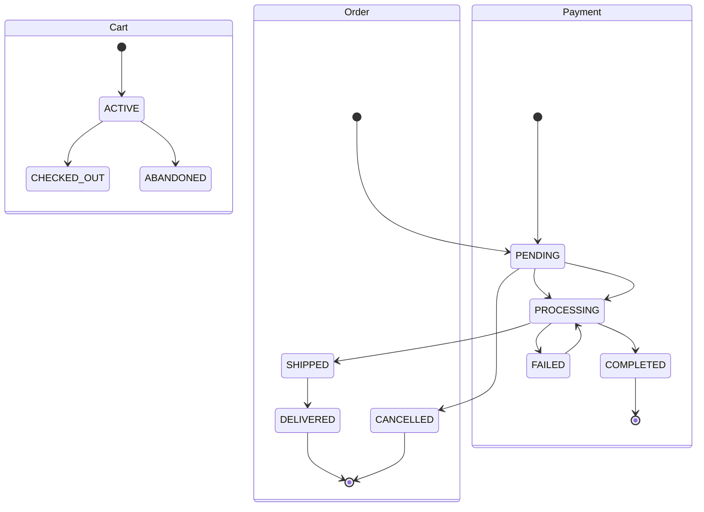

# 🛒 E-commerce Flow — Carrito, Órdenes y Pagos con Stripe

# 📚 Tabla de Contenido

1. Arquitectura General
2. Diferencia entre Carrito, Orden y Pago
3. Flujo Completo del Usuario
4. Flujo del Carrito
5. Flujo del Checkout
6. Flujo del Pago con Stripe
7. Flujo del Webhook
8. Máquina de Estados
9. Diagramas Mermaid
10. Modelo ER Completo
11. Endpoints REST
12. Casos de Error
13. Seguridad
14. Buenas Prácticas

---

# 🧠 1. Arquitectura General

Un e-commerce NO funciona así:

```text
Producto → Pago
```

Funciona así:

```text
Producto
   ↓
Carrito (editable)
   ↓
Orden (snapshot congelado)
   ↓
Pago
   ↓
Webhook Stripe
   ↓
Procesamiento
   ↓
Envío
```

---

# 🎯 2. Diferencia entre Cart, Order y Payment

| Entidad | Qué representa           | Se puede modificar | Tiene pago |
| ------- | ------------------------ | ------------------ | ---------- |
| CART    | Productos temporales     | ✅ Sí              | ❌ No      |
| ORDER   | Compra oficial congelada | ❌ No              | ✅ Sí      |
| PAYMENT | Estado del pago          | ⚠️ Parcialmente    | ✅ Sí      |

---

# 🛒 3. Flujo REAL del Usuario

```text
Cliente entra a tienda
   ↓
Agrega productos al carrito
   ↓
Modifica cantidades
   ↓
Hace click "Continuar compra"
   ↓
Se crea ORDER
   ↓
Pantalla Checkout
   ↓
Hace click "Pagar ahora"
   ↓
Stripe Checkout
   ↓
Webhook Stripe
   ↓
Pago confirmado
   ↓
ORDER → processing
   ↓
Envío
```

---

# 🛒 4. Flujo del Carrito

# 📌 ¿Cuándo se crea el carrito?

NO se crea un carrito nuevo por cada producto.

El flujo correcto es:

```text
Cliente agrega primer producto
   ↓
Backend verifica:
   "¿Tiene carrito activo?"
   ↓
SI NO:
   crear CART
SI SÍ:
   reutilizar CART
```

---

# 📌 ¿Cada click hace petición al backend?

✅ Sí.

Cada acción del carrito normalmente hace request.

Ejemplo:

| Acción           | Endpoint                |
| ---------------- | ----------------------- |
| Agregar producto | POST /cart/items        |
| Cambiar cantidad | PATCH /cart/items/{id}  |
| Eliminar item    | DELETE /cart/items/{id} |
| Vaciar carrito   | DELETE /cart            |

---

# 📌 Flujo agregar producto

## Usuario

```text
[ Agregar al carrito ]
```

---

## Frontend

```http
POST /cart/items
```

Body:

```json
{
  "product_id": 8,
  "quantity": 2
}
```

---

## Backend

### Paso 1

Buscar carrito activo:

```sql
SELECT *
FROM carts
WHERE customer_id = 5
AND status = 'active'
LIMIT 1;
```

---

### Paso 2

## Si NO existe

Crear carrito:

```text
CART
- status = active
- customer_id = 5
```

---

### Paso 3

Buscar si producto ya existe:

```sql
SELECT *
FROM cart_items
WHERE cart_id = 10
AND product_id = 8;
```

---

### Paso 4A

## Si existe

Actualizar cantidad:

```text
quantity += 2
```

---

### Paso 4B

## Si NO existe

Crear item:

```text
CART_ITEM
- cart_id = 10
- product_id = 8
- quantity = 2
- price = 75
```

---

### Paso 5

Recalcular carrito:

```text
subtotal = SUM(items)
tax = cálculo impuestos
shipping = cálculo envío
total = subtotal + tax + shipping
```

---

# 🔄 Flujo Visual — Carrito



---

# 📦 5. Flujo del Checkout

# 📌 ¿Qué hace “Continuar compra”?

Aquí NO se paga todavía.

Aquí se crea:

✅ ORDER
✅ ORDER_DETAILS
✅ PAYMENT pending

---

# 📌 Botón correcto

En carrito:

```text
[ Continuar compra ]
```

NO:

```text
[ Pagar ]
```

Porque aún no existe ORDER.

---

# 📌 Qué pasa internamente

```text
CART
   ↓
ORDER
   ↓
ORDER_DETAILS
   ↓
PAYMENT pending
```

---

# 📌 Flujo Checkout

## Frontend

```http
POST /checkout
```

---

## Backend

### Paso 1

Obtener carrito activo.

---

### Paso 2

Validar:

✅ carrito no vacío
✅ stock disponible
✅ productos activos

---

### Paso 3

Crear ORDER:

```text
ORDER
- status = pending
- total_amount = total carrito
- payment_deadline = NOW + 24h
```

---

### Paso 4

Copiar items:

```text
CART_ITEMS
   ↓
ORDER_DETAILS
```

IMPORTANTE:

La orden es un snapshot congelado.

---

### Paso 5

Crear PAYMENT:

```text
PAYMENT
- order_id = 1001
- status = pending
```

---

### Paso 6

Marcar carrito:

```text
CART.status = checked_out
```

---

# 🔄 Flujo Visual — Checkout



---

# 💳 6. Flujo de Pago con Stripe

# 📌 Pantalla Checkout

Ahora sí existe ORDER.

La UI muestra:

- dirección
- total congelado
- productos
- impuestos
- envío

Botón:

```text
[ Pagar ahora ]
```

---

# 📌 Qué hace ese botón

```http
POST /orders/{id}/pay
```

---

# 📌 Backend

## Paso 1

Buscar ORDER.

---

## Paso 2

Buscar PAYMENT.

---

## Paso 3

Crear PaymentIntent en Stripe.

---

# 📌 Ejemplo Stripe

```python
intent = stripe.PaymentIntent.create(
    amount=18500,
    currency="usd",
    metadata={
        "order_id": 1001
    }
)
```

---

## Paso 4

Guardar:

```text
PAYMENT
- stripe_payment_intent_id
- status = processing
```

---

## Paso 5

Retornar:

```json
{
  "checkout_url": "https://checkout.stripe.com/..."
}
```

---

# 🔄 Flujo Visual — Pago



---

# 🪝 7. Flujo del Webhook

# 📌 ¿Qué es el webhook?

Stripe le avisa a tu backend:

```text
"El pago fue exitoso"
```

---

# 📌 Stripe envía

```http
POST /webhooks/stripe
```

Evento:

```text
payment_intent.succeeded
```

---

# 📌 Tu backend

## Paso 1

Verificar firma.

---

## Paso 2

Buscar PAYMENT por:

```text
stripe_payment_intent_id
```

---

## Paso 3

Guardar transaction.

---

## Paso 4

Actualizar:

```text
PAYMENT.status = completed
ORDER.status = processing
```

---

# 🔄 Flujo Visual — Webhook



---

# 🔄 8. Máquina de Estados



---

# 📐 9. ER Diagram Completo

```mermaid
erDiagram

CUSTOMERS ||--|| CARTS : owns

CARTS ||--o{ CART_ITEMS : contains

PRODUCTS ||--o{ CART_ITEMS : added_to

CUSTOMERS ||--o{ ORDERS : creates

ORDERS ||--|{ ORDER_DETAILS : contains

PRODUCTS ||--o{ ORDER_DETAILS : referenced_by

ORDERS ||--|| PAYMENTS : has

PAYMENTS ||--o{ PAYMENT_TRANSACTIONS : logs

ORDERS ||--o{ ORDER_TIMELINE : generates

CUSTOMERS {
    int id PK
    string names
    string email UK
}

CARTS {
    int id PK
    int customer_id FK UK

    string status

    decimal subtotal
    decimal tax
    decimal shipping_cost
    decimal total

    datetime expires_at

    datetime created_at
    datetime updated_at
}

CART_ITEMS {
    int id PK

    int cart_id FK
    int product_id FK

    int quantity
    decimal price

    datetime added_at
}

PRODUCTS {
    int id PK

    string name
    decimal price
    int stock
}

ORDERS {
    int id PK

    int customer_id FK

    decimal total_amount

    string status

    string shipping_address

    datetime payment_deadline

    datetime created_at
}

ORDER_DETAILS {
    int id PK

    int order_id FK
    int product_id FK

    int quantity
    decimal price
}

PAYMENTS {
    int id PK

    int order_id FK UK

    string status

    string stripe_payment_intent_id UK
    string stripe_charge_id

    string payment_method_type

    text error_message

    datetime webhook_received_at
}

PAYMENT_TRANSACTIONS {
    int id PK

    int payment_id FK

    string stripe_event_id UK

    string status

    decimal amount

    json metadata_json
}

ORDER_TIMELINE {
    int id PK

    int order_id FK

    string event_type

    string status_from
    string status_to

    datetime created_at
}
```

---

# 🌐 10. Endpoints REST

## Cart

```http
GET    /cart
POST   /cart/items
PATCH  /cart/items/{id}
DELETE /cart/items/{id}
DELETE /cart
```

---

## Checkout

```http
POST /checkout
```

---

## Orders

```http
GET /orders
GET /orders/{id}
POST /orders/{id}/pay
POST /orders/{id}/cancel
```

---

## Stripe

```http
POST /webhooks/stripe
```

---

# ⚠️ 11. Casos de Error

## Pago rechazado

```text
PAYMENT.status = failed
ORDER sigue pending
cliente puede reintentar
```

---

## Webhook duplicado

Usar:

```text
stripe_event_id UNIQUE
```

---

## Timeout de pago

Cron:

```text
payment_deadline < NOW()
```

Entonces:

```text
ORDER = cancelled
PAYMENT = cancelled
```

---

# 🔐 12. Seguridad

## NUNCA guardar tarjetas

Stripe maneja todo.

---

## Verificar webhook

```python
stripe.Webhook.construct_event(...)
```

---

## HTTPS obligatorio

Stripe requiere HTTPS.

---

## Idempotencia

```text
stripe_event_id UNIQUE
```

---

# ✅ 13. Arquitectura Correcta

```text
PRODUCTS
   ↓
CART
   ↓
CHECKOUT
   ↓
ORDER
   ↓
PAYMENT
   ↓
STRIPE
   ↓
WEBHOOK
   ↓
PAYMENT_TRANSACTION
   ↓
FULFILLMENT
```
