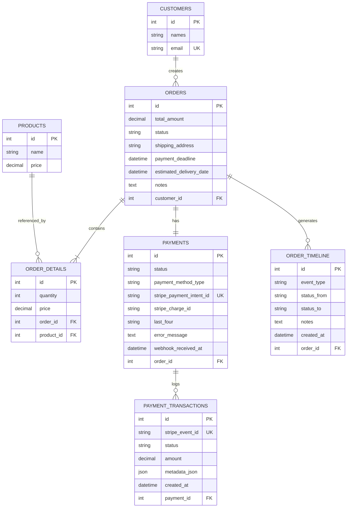
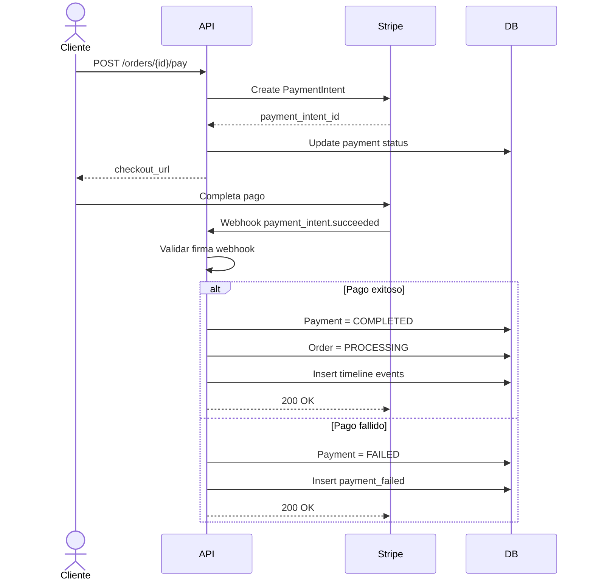
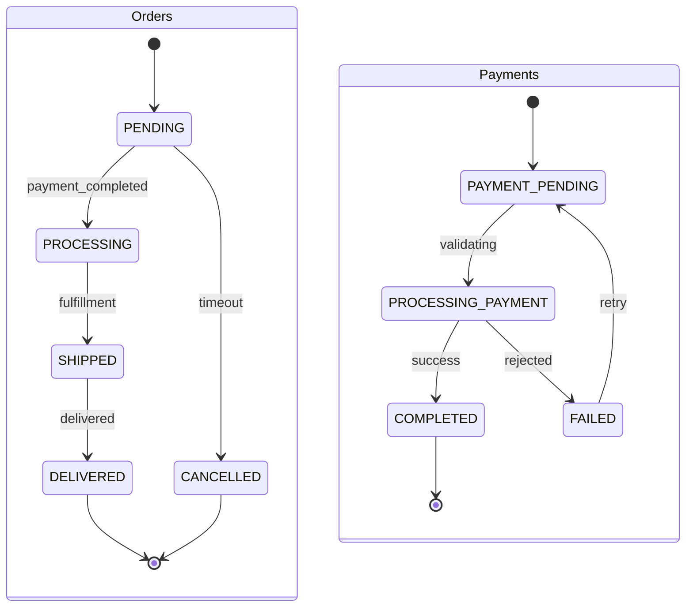
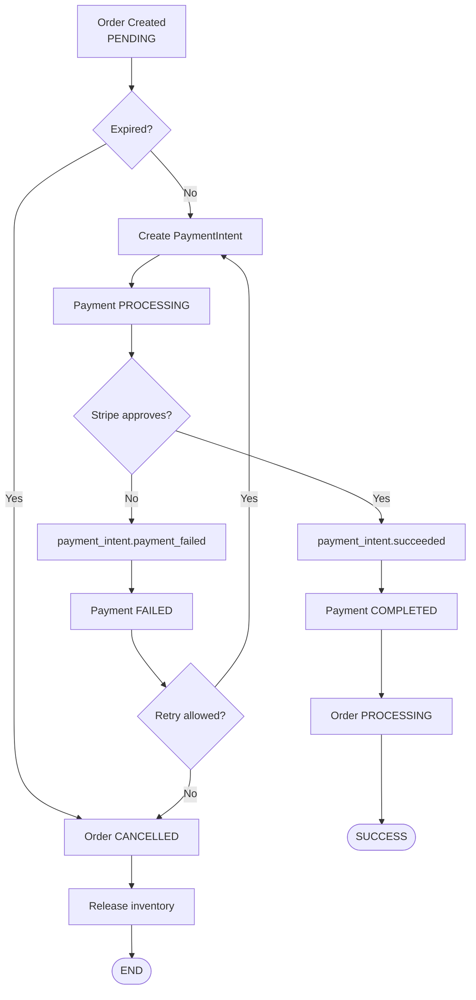
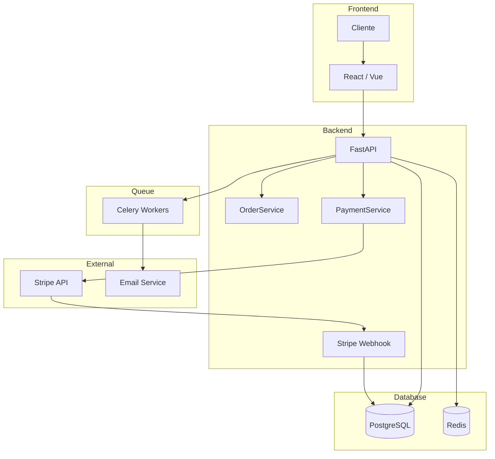
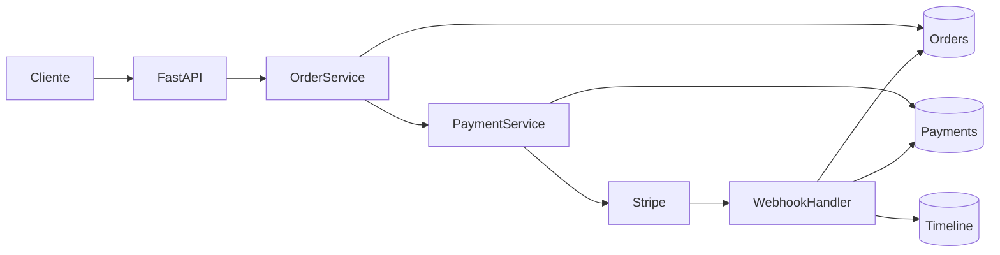

# 📦 Flujo de Procesamiento de Órdenes con Stripe

## 🎯 Resumen Ejecutivo

Este documento describe una arquitectura robusta para procesar órdenes en un e-commerce utilizando Stripe como pasarela de pagos.

Incluye:

- Modelo entidad-relación corregido
- Flujo de pagos con Payment Intents
- Webhooks e idempotencia
- Manejo de errores
- Máquina de estados
- Seguridad y validaciones
- Diagramas Mermaid corregidos y compatibles

---

# 📊 Flujo General del Sistema

## Flujo recomendado con Stripe

```text
Order (PENDING)
    ↓
Crear PaymentIntent en Stripe
    ↓
Cliente paga en Stripe Checkout
    ↓
Stripe envía webhook
    ↓
Webhook valida firma
    ↓
Payment = COMPLETED
    ↓
Order = PROCESSING
    ↓
Fulfillment
    ↓
SHIPPED → DELIVERED
```

---

# 🧱 Modelo de Datos

## Tabla `payments` — Campos adicionales

```python
stripe_payment_intent_id: String(unique=True)
stripe_charge_id: String(nullable=True)

payment_method_type: Enum(
    "card",
    "bank_transfer",
    "wallet"
)

last_four: String(4, nullable=True)

error_message: Text(nullable=True)

webhook_received_at: DateTime(nullable=True)
```

---

# 🆕 Nuevas Tablas

## `payment_transactions`

Auditoría de TODOS los intentos de pago.

```python
id: PK

payment_id: FK -> payments.id

stripe_event_id: String(unique=True)

status: Enum(
    "pending",
    "succeeded",
    "failed"
)

amount: Decimal

metadata_json: JSON

created_at: DateTime
```

---

## `order_timeline`

Historial completo de eventos de la orden.

```python
id: PK

order_id: FK -> orders.id

event_type: Enum(
    "created",
    "payment_started",
    "payment_completed",
    "payment_failed",
    "processing",
    "shipped",
    "delivered",
    "cancelled"
)

status_from: String(nullable=True)

status_to: String(nullable=True)

user_id: FK -> users.id(nullable=True)

notes: Text(nullable=True)

created_at: DateTime
```

---

# 🧾 Tabla `orders` — Nuevos campos

```python
shipping_address: String

estimated_delivery_date: DateTime(nullable=True)

payment_deadline: DateTime

notes: Text(nullable=True)
```

---

# 📐 Diagrama Entidad-Relación (ER) — Mermaid Corregido



---

# 🔄 Relaciones del Sistema

```text
CUSTOMERS (1)
    └── ORDERS (N)
            ├── ORDER_DETAILS (N)
            │       └── PRODUCTS
            │
            ├── PAYMENTS (1)
            │       └── PAYMENT_TRANSACTIONS (N)
            │
            └── ORDER_TIMELINE (N)
```

---

# 🧭 FASE 1 — Creación de Orden

## Paso 1 — Cliente crea carrito

El cliente:

- agrega productos
- define dirección de envío
- selecciona método de pago

---

## Paso 2 — Crear Order

```python
order.status = "PENDING"

order.payment_deadline = now() + timedelta(hours=24)
```

---

## Paso 3 — Crear OrderDetails

```python
for item in cart:
    OrderDetail.create(
        product_id=item.product_id,
        quantity=item.quantity,
        price=item.price
    )
```

---

## Paso 4 — Crear Payment

```python
payment.status = "PENDING"

payment.payment_method_type = "card"
```

---

## Paso 5 — Registrar Timeline

```python
OrderTimeline.create(
    event_type="created",
    status_from=None,
    status_to="PENDING"
)
```

---

# 💳 FASE 2 — Integración con Stripe

## Endpoint

```http
POST /orders/{id}/pay
```

---

## Crear PaymentIntent

```python
intent = stripe.PaymentIntent.create(
    amount=int(order.total_amount * 100),
    currency="usd",
    payment_method_types=["card"],
    metadata={
        "order_id": order.id
    }
)
```

---

## Guardar referencia Stripe

```python
payment.stripe_payment_intent_id = intent.id

payment.status = "PROCESSING"
```

---

## Registrar timeline

```python
OrderTimeline.create(
    event_type="payment_started",
    status_from="PENDING",
    status_to="PROCESSING"
)
```

---

# 🔀 Diagrama de Secuencia — Pago y Webhook



---

# 🪝 FASE 3 — Webhook Stripe

## Endpoint

```http
POST /webhooks/stripe
```

---

## Validación de Firma

```python
event = stripe.Webhook.construct_event(
    payload=body,
    sig_header=sig_header,
    secret=STRIPE_ENDPOINT_SECRET
)
```

---

## Extraer datos del charge

```python
charge = event.data.object.charges.data[0]

payment.stripe_charge_id = charge.id

payment.last_four = (
    charge.payment_method_details.card.last4
)

payment.webhook_received_at = now()
```

---

## Registrar PaymentTransaction

```python
PaymentTransaction.create(
    payment_id=payment.id,
    stripe_event_id=event.id,
    status="succeeded",
    amount=order.total_amount,
    metadata_json=event.to_dict()
)
```

---

## Actualizar estados

```python
payment.status = "COMPLETED"

order.status = "PROCESSING"
```

---

# 📦 FASE 4 — Fulfillment

## Order PROCESSING

Significa:

- pago confirmado
- iniciar preparación
- generar envío

---

## Registrar timeline

```python
OrderTimeline.create(
    event_type="processing",
    status_from="PENDING",
    status_to="PROCESSING"
)
```

---

# 🚚 FASE 5 — Envío y Entrega

## Cuando se envía

```python
order.status = "SHIPPED"
```

Acciones:

- generar tracking
- enviar email
- calcular ETA

---

## Cuando se entrega

```python
order.status = "DELIVERED"
```

Acciones:

- registrar entrega
- solicitar review

---

# ⚠️ Casos de Error

---

## Caso 1 — Orden expirada

```text
PENDING > 24h
    ↓
CANCELLED
```

Acciones:

- liberar inventario
- cancelar PaymentIntent
- enviar email

---

## Caso 2 — Pago rechazado

Webhook:

```text
payment_intent.payment_failed
```

Acciones:

- Payment = FAILED
- guardar error_message
- permitir retry

---

## Caso 3 — Reintento de pago

```text
FAILED
    ↓
Nuevo PaymentIntent
```

Se reemplaza:

```python
payment.stripe_payment_intent_id
```

---

## Caso 4 — Webhook duplicado

Solución:

```python
stripe_event_id UNIQUE
```

---

## Caso 5 — Cancelación manual

```python
stripe.PaymentIntent.cancel(intent_id)
```

---

# 🔄 Máquina de Estados — Mermaid Corregido



---

# 🚨 Flujo de Errores — Mermaid Corregido



---

# 🏗️ Arquitectura del Sistema — Mermaid Corregido



---

# 📊 Data Flow Diagram — Mermaid Corregido



---

# ✅ Validaciones Clave

```text
✔ Order.total_amount >= 0

✔ total_amount = SUM(order_details)

✔ Un Payment por Order

✔ stripe_payment_intent_id UNIQUE

✔ Verificar firma del webhook

✔ stripe_event_id UNIQUE

✔ payment_deadline futuro

✔ COMPLETED => Order != PENDING

✔ Registrar TODOS los cambios en timeline
```

---

# 🔐 Seguridad

## Nunca guardar tarjetas

Stripe maneja:

- PAN
- CVV
- expiración
- tokenización

Tu backend nunca toca datos sensibles.

---

## Validar webhooks

```python
stripe.Webhook.construct_event(
    body,
    sig_header,
    STRIPE_ENDPOINT_SECRET
)
```

---

## HTTPS obligatorio

Stripe requiere HTTPS para webhooks.

---

## Variables de entorno

```env
STRIPE_SECRET_KEY=
STRIPE_WEBHOOK_SECRET=
```

---

# 📋 Checklist de Implementación

```text
[ ] Agregar campos a payments
[ ] Crear payment_transactions
[ ] Crear order_timeline
[ ] Crear migraciones Alembic

[ ] Implementar POST /orders/{id}/pay

[ ] Implementar POST /webhooks/stripe

[ ] Validar firmas Stripe

[ ] Crear PaymentService

[ ] Crear OrderService

[ ] Implementar state machine

[ ] Configurar retries

[ ] Configurar cron expiración

[ ] Configurar Stripe Dashboard

[ ] Crear tests

[ ] Documentar Swagger/Postman
```

---

# 📚 Referencias Oficiales

- [Stripe Payment Intents API](https://stripe.com/docs/payments/payment-intents?utm_source=chatgpt.com)
- [Stripe Webhooks](https://stripe.com/docs/webhooks?utm_source=chatgpt.com)
- [Webhook Signature Verification](https://stripe.com/docs/webhooks/signatures?utm_source=chatgpt.com)
- [PCI Compliance en Stripe](https://stripe.com/docs/security/compliance?utm_source=chatgpt.com)

---

# 🚀 Próximos Pasos

1. Crear migraciones Alembic
2. Implementar modelos SQLAlchemy
3. Crear servicios de dominio
4. Implementar endpoints FastAPI
5. Integrar Stripe SDK
6. Crear tests unitarios/integración
7. Configurar observabilidad y logs
8. Deploy y monitoreo
