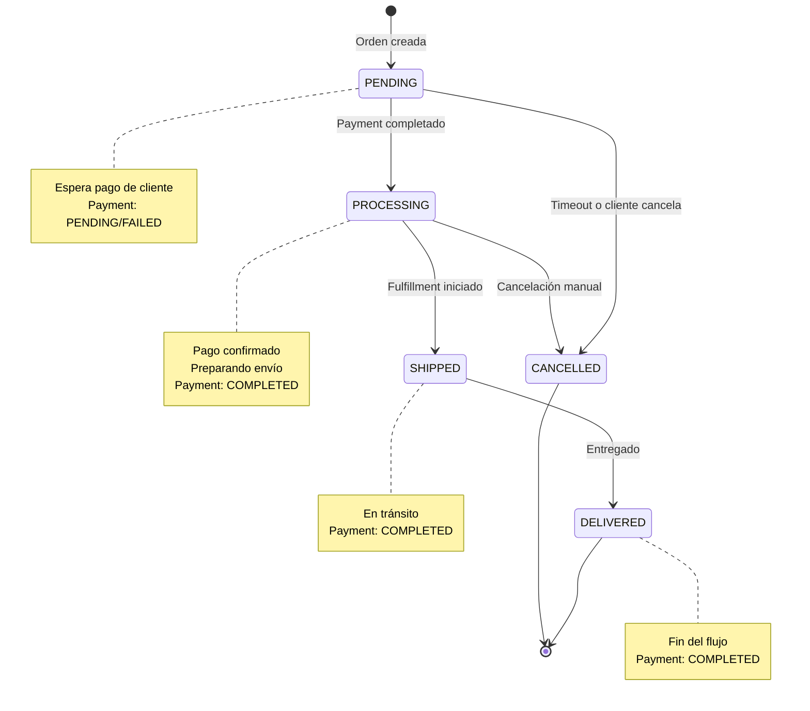
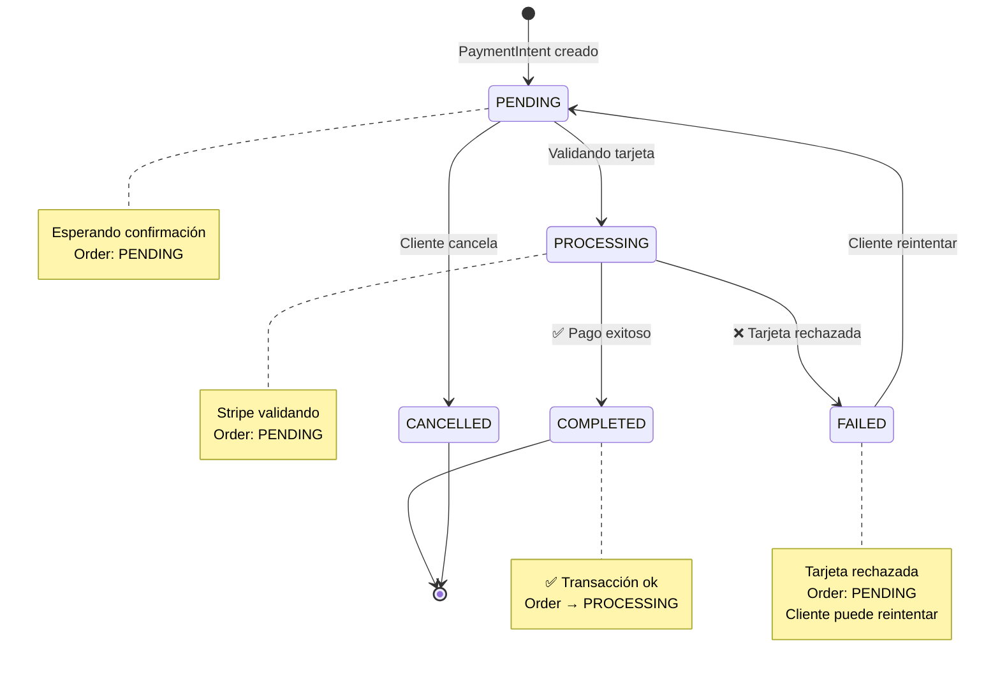
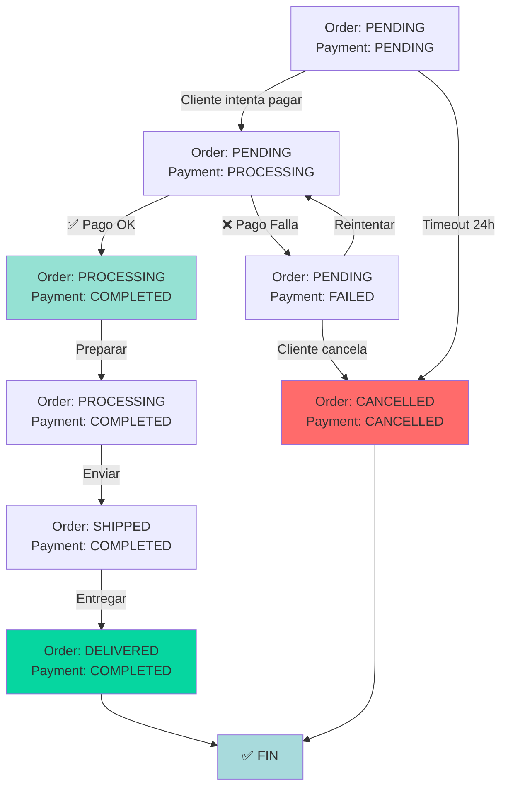
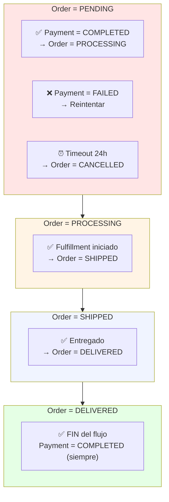
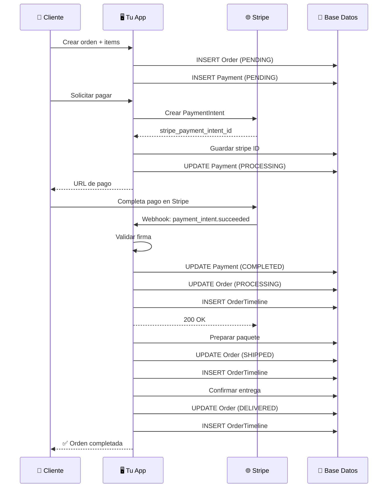
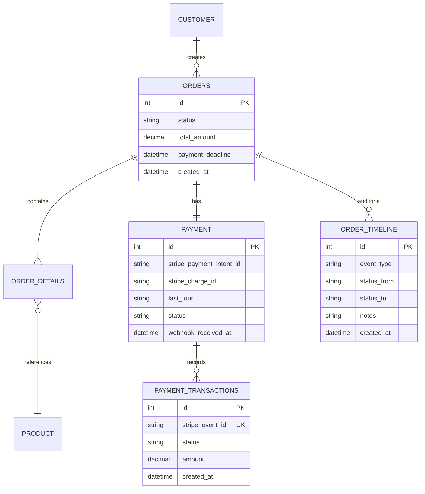
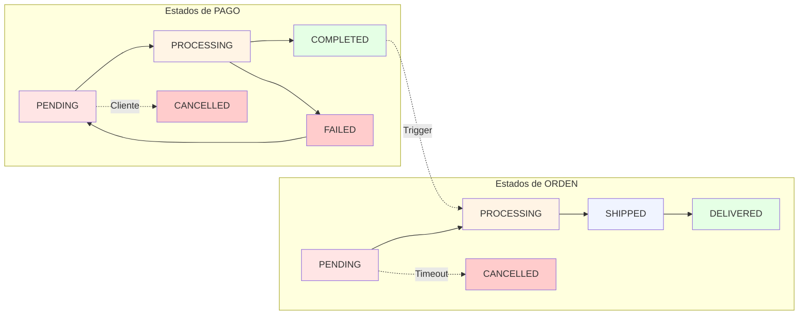

"""

# 📁 Estructura del Proyecto

Este proyecto FastAPI sigue una arquitectura en capas pensada para:

- Mantener el código organizado
- Escalar bien en proyectos pequeños–medios
- Facilitar el mantenimiento y las pruebas
- Evitar sobreingeniería innecesaria

La estructura principal del proyecto es la siguiente:

```
project_name/
│
├── app/
│ ├── **init**.py
│ ├── main.py
│ ├── api/
│ │ ├── **init**.py
│ │ ├── v1/
│ │ │ ├── **init**.py
│ │ │ └── endpoints/
│ │ │ ├── user.py
│ │ │ ├── auth.py
│ │ │ └── item.py
│ │ └── dependencies/
│ │ ├── **init**.py
│ │ ├── database.py
│ │ └── auth.py
│ │
│ ├── core/
│ │ ├── **init**.py
│ │ ├── config.py
│ │ └── security.py
│ │
│ ├── exceptions/
│ │ ├── **init**.py
│ │ ├── custom_exceptions.py
│ │ └── handlers.py
│ │
│ ├── database/
│ │ ├── **init**.py
│ │ ├── base.py
│ │ ├── session.py
│ │ └── models/
│ │ ├── **init**.py
│ │ ├── user.py
│ │ └── item.py
│ │
│ ├── schemas/
│ │ ├── **init**.py
│ │ ├── user.py
│ │ └── item.py
│ │
│ ├── services/
│ │ ├── **init**.py
│ │ ├── user_service.py
│ │ └── item_service.py
│ │
│ └── tests/
│ ├── **init**.py
│ ├── test_user.py
│ └── test_item.py
│
├── .env
├── requirements.txt
└── README.md
```

---

## 🧩 Descripción de las carpetas

### app/main.py

Punto de entrada de la aplicación.

Aquí se crea la instancia de FastAPI y se registran los routers principales.
No debe contener lógica de negocio.

---

### app/api/

Capa de presentación (HTTP).  
Contiene todo lo relacionado con FastAPI.

#### api/v1/endpoints/

Aquí van los routers de FastAPI:

- Definición de endpoints
- Validación de entrada y salida usando schemas
- Llamadas a la capa de servicios

No debe contener:

- Lógica de negocio
- Acceso directo complejo a la base de datos

---

#### api/dependencies/

Aquí van las dependencias usadas con Depends:

- get_db() para sesión de base de datos
- get_current_user() para autenticación
- Dependencias de permisos o roles

Son funciones acopladas a FastAPI y reutilizables entre muchos endpoints.

---

### app/core/

Configuración y utilidades globales de la aplicación.

Aquí van:

- Carga de variables de entorno (Settings)
- Constantes globales
- Lógica transversal de seguridad:
  - Hashing de contraseñas
  - Creación y verificación de JWT

Regla importante:

Nada en core debe depender de FastAPI.

---

### app/exceptions/

Gestión centralizada de excepciones personalizadas.

Aquí se definen:

- Excepciones personalizadas de la aplicación
- Manejadores de excepciones (exception handlers)
- Mapeadores de errores a respuestas HTTP

**Excepciones disponibles:**

- `ValidationException` (422): Error de validación de datos
- `NotFoundException` (404): Recurso no encontrado
- `UnauthorizedException` (401): Usuario no autenticado
- `ForbiddenException` (403): Usuario sin permisos suficientes
- `ConflictException` (409): Conflicto al crear o actualizar
- `InternalServerException` (500): Error interno del servidor

**Uso en servicios:**

```python
from app.exceptions import NotFoundException, ValidationException

def get_user(user_id: int):
    user = db.query(User).filter(User.id == user_id).first()
    if not user:
        raise NotFoundException(f"Usuario con id {user_id} no encontrado")
    return user
```

**Registrar handlers en main.py:**

```python
from app.exceptions import register_exception_handlers

app = FastAPI()
register_exception_handlers(app)
```

---

### app/db/

Capa de persistencia.

Aquí se define:

- Conexión a la base de datos (engine, SessionLocal)
- Base de SQLAlchemy
- Modelos ORM (tablas)

Responsabilidad:

- Infraestructura de base de datos
- Sin lógica de negocio

---

### app/schemas/

Modelos Pydantic para:

- Validar datos de entrada (requests)
- Definir datos de salida (responses)

Aquí no va:

- Lógica de negocio
- Acceso a base de datos

Solo definición de estructuras de datos.

---

### app/services/

Capa de lógica de negocio.

Aquí viven las reglas reales de la aplicación:

- Crear usuario
- Validar condiciones de negocio
- Orquestar operaciones entre modelos

No debe haber:

- APIRouter
- Depends
- Código específico de FastAPI

---

### app/tests/

Tests automatizados de la aplicación.

Se recomienda:

- Un archivo de test por módulo
- Probar servicios y endpoints críticos

---

## 🔄 Flujo típico de una petición

Request HTTP
↓
api/endpoints/ -> Router FastAPI
↓
schemas/ -> Validación de datos
↓
services/ -> Lógica de negocio
↓
db/models/ -> Persistencia
↓
Response

---

## 🎯 Principios de esta arquitectura

- Separación clara de responsabilidades
- La capa HTTP no contiene lógica de negocio
- La lógica de negocio no depende de FastAPI
- La infraestructura está aislada

Esta estructura permite:

- Escalar el proyecto con orden
- Facilitar el mantenimiento
- Testear cada capa de forma independiente
- Evolucionar la arquitectura sin reescribir todo
  """
  | Comando | Descripción |
  | ---------------------------------------------- | ---------------------------------------------------------------------------------------------------------------------------------------- |
  | `alembic init alembic` | Inicializa Alembic (solo una vez). Crea carpeta `alembic/` y `alembic.ini`. |
  | `alembic revision --autogenerate -m "mensaje"` | Crea un archivo de migración basado en los modelos de SQLAlchemy (`Base.metadata`). El `--autogenerate` detecta cambios automáticamente. |
  | `alembic upgrade head` | Aplica todas las migraciones pendientes hasta la última versión (`head`). |
  | `alembic downgrade -1` | Revierte la última migración aplicada. |
  | `alembic current` | Muestra la versión actual de la base de datos según Alembic. |
  | `alembic history` | Muestra el historial de migraciones aplicadas y pendientes. |
  | `alembic show <revision>` | Muestra los detalles de una migración específica. |

# Usando Uvicorn, desde la raíz del proyecto

2️⃣ Comandos para correr tu FastAPI
uvicorn app.main:app --reload

3️⃣ Acceder a Swagger

Una vez el servidor está corriendo:

Swagger UI: http://127.0.0.1:8000/docs

Redoc: http://127.0.0.1:8000/redoc

---

---

# 💳 Integración con Stripe - Configuración de Webhooks

## 📋 Requisitos

- Cuenta en [Stripe](https://stripe.com)
- Stripe CLI instalado
- Las claves API en `.env`

---

## 🔧 Instalación de Stripe CLI

### **Windows (PowerShell)**

```powershell
# Opción 1: Con Chocolatey (recomendado)
choco install stripe-cli

# Opción 2: Descarga manual
# Ve a: https://github.com/stripe/stripe-cli/releases
# Descarga stripe_X.X.X_windows_x86_64.exe
# Ejecuta el instalador

# Verificar instalación
stripe --version
```

### **Mac**

```bash
# Con Homebrew
brew install stripe/stripe-cli/stripe

# Verificar
stripe --version
```

### **Linux**

```bash
# Debian/Ubuntu
apt-get install -y stripe

# Verificar
stripe --version
```

---

## 🚀 Configuración Inicial de Stripe CLI

### **Paso 1: Login a tu cuenta Stripe**

```powershell
stripe login

# Se abrirá el navegador
# Autoriza y regresa a la terminal
# Deberías ver: "Done! Your API key is configured to stripe account..."
```

### **Paso 2: Obtener y guardar el Webhook Secret**

```powershell
# En una terminal, escucha los webhooks
stripe listen --forward-to localhost:8000/webhooks/stripe

# Output esperado:
# > Getting ready to listen to all events
# > Ready! Your webhook signing secret is whsec_test_...
```

**Guarda ese secret en `.env`:**

```env
STRIPE_API_KEY=sk_test_...  # Ya deberías tenerla
STRIPE_WEBHOOK_SECRET=whsec_test_...  # Cópiala aquí
```

---

## 🧪 Testing en DESARROLLO (localhost)

### **Workflow de testing completo:**

**Terminal 1: Inicia tu app FastAPI**

```powershell
cd d:\Python\ecommerce
.\.venv\Scripts\Activate.ps1
uvicorn app.main:app --reload
# Corriendo en http://localhost:8000
```

**Terminal 2: Escucha webhooks de Stripe**

```powershell
stripe listen --forward-to localhost:8000/webhooks/stripe
# Ready! Webhook secret: whsec_test_...
```

**Terminal 3: Simula eventos de Stripe**

```powershell
# Simular pago completado
stripe trigger payment_intent.succeeded

# Simular pago fallido
stripe trigger payment_intent.payment_failed

# Simular pago pendiente
stripe trigger payment_intent.created

# Ver todos los eventos disponibles
stripe trigger --help
```

**Lo que sucede:**

```
Terminal 3: stripe trigger payment_intent.succeeded
    ↓
Stripe genera evento
    ↓
Terminal 2 (stripe listen) lo captura
    ↓
Reenvía a Terminal 1 (localhost:8000/webhooks/stripe)
    ↓
Tu app recibe y procesa el webhook
    ↓
Base de datos se actualiza
```

---

## 📝 Código para recibir webhooks (app/api/v1/endpoints/webhooks.py)

```python
import stripe
from fastapi import APIRouter, Request, HTTPException
from app.core.config import settings
from app.database.session import SessionLocal
from app.database.models.payment import Payment, PaymentStatus
from app.database.models.order import Order, OrderStatus
from app.database.models.order_timeline import OrderTimeline, EventType

router = APIRouter(prefix="/webhooks", tags=["webhooks"])

@router.post("/stripe")
async def stripe_webhook(request: Request):
    """
    Recibe webhooks de Stripe
    Valida la firma y procesa el evento
    """

    # 1. Obtener firma y payload
    sig_header = request.headers.get('stripe-signature')
    payload = await request.body()

    if not sig_header:
        raise HTTPException(status_code=400, detail="Missing signature")

    # 2. Validar que sea de Stripe (CRÍTICO para seguridad)
    try:
        event = stripe.Webhook.construct_event(
            payload, sig_header, settings.STRIPE_WEBHOOK_SECRET
        )
    except ValueError as e:
        raise HTTPException(status_code=400, detail=f"Invalid payload: {e}")
    except stripe.error.SignatureVerificationError as e:
        raise HTTPException(status_code=400, detail=f"Invalid signature: {e}")

    # 3. Procesar el evento
    db = SessionLocal()

    try:
        if event['type'] == 'payment_intent.succeeded':
            await handle_payment_succeeded(event, db)

        elif event['type'] == 'payment_intent.payment_failed':
            await handle_payment_failed(event, db)

        elif event['type'] == 'payment_intent.canceled':
            await handle_payment_cancelled(event, db)

        db.commit()

    except Exception as e:
        db.rollback()
        raise HTTPException(status_code=500, detail=str(e))

    finally:
        db.close()

    return {"status": "received"}


async def handle_payment_succeeded(event, db):
    """Procesa payment_intent.succeeded"""
    payment_intent = event['data']['object']
    charge = payment_intent['charges']['data'][0]

    # Encontrar el pago en BD
    payment = db.query(Payment).filter(
        Payment.stripe_payment_intent_id == payment_intent['id']
    ).first()

    if not payment:
        return  # Webhook de otro pago o idempotencia

    # Actualizar Payment
    payment.stripe_charge_id = charge['id']
    payment.last_four = charge['payment_method_details']['card']['last4']
    payment.webhook_received_at = datetime.now(timezone.utc)
    payment.status = PaymentStatus.completed

    # Actualizar Order
    order = payment.order
    order.status = OrderStatus.processing

    # Crear evento en timeline
    timeline = OrderTimeline(
        order_id=order.id,
        event_type=EventType.payment_completed,
        status_from=OrderStatus.pending,
        status_to=OrderStatus.processing,
        notes=f"Pago completado - Charge ID: {charge['id']}"
    )

    db.add(timeline)
    db.flush()


async def handle_payment_failed(event, db):
    """Procesa payment_intent.payment_failed"""
    payment_intent = event['data']['object']

    payment = db.query(Payment).filter(
        Payment.stripe_payment_intent_id == payment_intent['id']
    ).first()

    if not payment:
        return

    # Actualizar Payment
    payment.error_message = payment_intent.get('last_payment_error', {}).get('message', 'Unknown error')
    payment.status = PaymentStatus.failed

    # Order se queda en PENDING (cliente puede reintentar)

    # Crear evento en timeline
    timeline = OrderTimeline(
        order_id=payment.order_id,
        event_type=EventType.payment_failed,
        status_from=OrderStatus.pending,
        status_to=OrderStatus.pending,
        notes=f"Pago rechazado: {payment.error_message}"
    )

    db.add(timeline)
    db.flush()


async def handle_payment_cancelled(event, db):
    """Procesa payment_intent.canceled"""
    payment_intent = event['data']['object']

    payment = db.query(Payment).filter(
        Payment.stripe_payment_intent_id == payment_intent['id']
    ).first()

    if not payment:
        return

    # Actualizar Payment
    payment.status = PaymentStatus.cancelled

    # Actualizar Order
    order = payment.order
    order.status = OrderStatus.cancelled

    # Crear evento
    timeline = OrderTimeline(
        order_id=order.id,
        event_type=EventType.cancelled,
        status_from=order.status,
        status_to=OrderStatus.cancelled,
        notes="Pago cancelado por cliente"
    )

    db.add(timeline)
    db.flush()
```

---

## 🌍 Deployment a PRODUCCIÓN

Una vez despliegas tu app (ej: Heroku, Railway, etc):

### **Paso 1: Actualizar webhook en Stripe Dashboard**

1. Ve a [Stripe Dashboard](https://dashboard.stripe.com)
2. Desarrolladores → Webhooks
3. Cambia endpoint de `localhost` a tu URL de producción
4. Ej: `https://tu-app.com/webhooks/stripe`
5. Obtén el nuevo secret (whsec*prod*...)
6. Actualiza en `.env` de producción

### **Paso 2: Ya no necesitas Stripe CLI en producción**

- Los webhooks llegan directamente a `https://tu-app.com/webhooks/stripe`
- Tu app recibe y procesa automáticamente

### **Comparativa:**

```
DESARROLLO (localhost)
┌──────────────┐      ┌──────────────┐      ┌──────────────┐
│ Tu app       │      │ Stripe CLI   │      │ Stripe       │
│ localhost    │←────→│ listen       │←────→│ Servers      │
│ :8000        │      │ (túnel)      │      │              │
└──────────────┘      └──────────────┘      └──────────────┘

PRODUCCIÓN
┌──────────────┐                           ┌──────────────┐
│ Tu app       │←──────────────────────────│ Stripe       │
│ https://...  │      Webhook directo      │ Servers      │
│              │                           │              │
└──────────────┘                           └──────────────┘
```

---

---

# 🔄 MÁQUINA DE ESTADOS - Órdenes y Pagos

## 📊 Estados de una Orden

Una orden puede estar en estos estados:



## 💰 Estados de un Payment



## 🔗 Relación Order ↔ Payment (Synchronized States)



## 🎯 Reglas de Transición Visualizadas



| De         | A          | Condición                                 |
| ---------- | ---------- | ----------------------------------------- |
| PENDING    | PROCESSING | Payment.status == COMPLETED               |
| PENDING    | CANCELLED  | payment_deadline expiró O cliente canceló |
| PROCESSING | SHIPPED    | Confirmación de fulfillment               |
| SHIPPED    | DELIVERED  | Confirmación de entrega                   |
| Cualquier  | CANCELLED  | Solo si Payment.status ≠ COMPLETED        |

---

## 🔄 Flujo Completo End-to-End (Sequence Diagram)



---

## 📊 Relación de Tablas en Diagrama ER



---

## 🎨 Timeline Visual de una Orden Típica

```mermaid
timeline
    title Ciclo de Vida de una Orden Exitosa

    section Creación
    10:00 : Orden creada : Order = PENDING
    10:01 : Payment registrado : Payment = PENDING

    section Pago
    10:05 : Cliente intenta pagar
    10:06 : Stripe valida tarjeta : Payment = PROCESSING
    10:07 : ✅ Pago confirmado : Payment = COMPLETED
    10:07 : Order automáticamente : Order = PROCESSING

    section Fulfillment
    10:20 : Preparando paquete
    10:30 : Paquete listo : Order = SHIPPED
    10:31 : Enviado a transportista

    section Entrega
    14:30 : En ruta
    15:30 : ✅ Entregado : Order = DELIVERED
    15:31 : Fin del flujo
```

---

## ❌ Timeline de Error - Pago Fallido y Reintento

```mermaid
timeline
    title Pago Fallido → Reintento Exitoso

    section Primer Intento
    10:00 : Orden creada : Order = PENDING
    10:05 : Cliente intenta pagar
    10:06 : Stripe valida : Payment = PROCESSING
    10:07 : ❌ Tarjeta rechazada : Payment = FAILED

    section Reintento
    10:15 : Cliente reintentar
    10:16 : Nueva validación : Payment = PENDING
    10:17 : ✅ Pago OK esta vez : Payment = COMPLETED
    10:17 : Order → PROCESSING

    section Fulfillment
    10:30 : Preparando paquete
    10:45 : Enviado : Order = SHIPPED
    15:00 : Entregado : Order = DELIVERED
```

---

## 📝 Modelos SQLAlchemy con Estados

```python
# app/database/models/order_timeline.py
from enum import Enum as PyEnum
from datetime import datetime, timezone
from decimal import Decimal
from sqlalchemy import Integer, String, DateTime, ForeignKey, Enum
from sqlalchemy.orm import Mapped, mapped_column, relationship
from app.database.session import Base


class EventType(str, PyEnum):
    """Tipos de eventos que pueden ocurrir en una orden"""
    created = "created"
    payment_started = "payment_started"
    payment_completed = "payment_completed"
    payment_failed = "payment_failed"
    processing = "processing"
    shipped = "shipped"
    delivered = "delivered"
    cancelled = "cancelled"


class OrderTimeline(Base):
    """Auditoría: Registra todos los cambios de estado"""
    __tablename__ = "order_timeline"

    id: Mapped[int] = mapped_column(Integer, primary_key=True, index=True)
    order_id: Mapped[int] = mapped_column(ForeignKey("orders.id"), nullable=False)

    event_type: Mapped[EventType] = mapped_column(Enum(EventType), nullable=False)
    status_from: Mapped[str] = mapped_column(String(50), nullable=True)
    status_to: Mapped[str] = mapped_column(String(50), nullable=False)

    notes: Mapped[str] = mapped_column(String(500), nullable=True)
    created_at: Mapped[datetime] = mapped_column(
        DateTime(timezone=True),
        default=lambda: datetime.now(timezone.utc)
    )

    # FK a user (quién hizo el cambio, si aplica)
    # user_id: Mapped[int] = mapped_column(ForeignKey("users.id"), nullable=True)


# app/database/models/payment_transactions.py
class PaymentTransaction(Base):
    """Auditoría de transacciones: Cada intento de pago"""
    __tablename__ = "payment_transactions"

    id: Mapped[int] = mapped_column(Integer, primary_key=True, index=True)
    payment_id: Mapped[int] = mapped_column(ForeignKey("payments.id"), nullable=False)

    stripe_event_id: Mapped[str] = mapped_column(String(255), unique=True, nullable=False)
    status: Mapped[str] = mapped_column(
        Enum("pending", "succeeded", "failed", name="transaction_status"),
        nullable=False
    )
    amount: Mapped[Decimal] = mapped_column(Numeric(10, 2), nullable=False)

    metadata_json: Mapped[dict] = mapped_column(JSON, nullable=True)
    created_at: Mapped[datetime] = mapped_column(
        DateTime(timezone=True),
        default=lambda: datetime.now(timezone.utc)
    )
```

---

---

## 📋 Query para ver historial de una orden

```python
# Obtener timeline de una orden
from app.database.models.order_timeline import OrderTimeline

timeline = db.query(OrderTimeline).filter(
    OrderTimeline.order_id == order_id
).order_by(OrderTimeline.created_at).all()

for event in timeline:
    print(f"{event.created_at} | {event.event_type} | {event.notes}")

# Output:
# 2026-05-14 10:00:00 | created | Order creada
# 2026-05-14 10:05:00 | payment_started | Pago iniciado
# 2026-05-14 10:06:00 | payment_completed | Pago completado - Charge: ch_123
# 2026-05-14 10:07:00 | processing | Preparando envío
# 2026-05-14 10:20:00 | shipped | En tránsito - Tracking: 123456
# 2026-05-14 15:30:00 | delivered | Entregado
```

---

## ✅ Validaciones en transiciones de estado

```python
# app/services/order_service.py
from app.database.models.order import Order, OrderStatus
from app.database.models.payment import Payment, PaymentStatus
from app.exceptions import ValidationException


class OrderService:

    @staticmethod
    def can_process_payment(order: Order) -> bool:
        """¿La orden puede procesar pago?"""
        return order.status == OrderStatus.pending

    @staticmethod
    def can_ship_order(order: Order) -> bool:
        """¿La orden puede enviarse?"""
        if order.status != OrderStatus.processing:
            raise ValidationException(
                f"Order must be PROCESSING to ship, currently: {order.status}"
            )

        if not order.payment or order.payment.status != PaymentStatus.completed:
            raise ValidationException(
                "Order cannot be shipped without completed payment"
            )

        return True

    @staticmethod
    def can_mark_delivered(order: Order) -> bool:
        """¿La orden puede marcarse como entregada?"""
        if order.status != OrderStatus.shipped:
            raise ValidationException(
                f"Order must be SHIPPED to mark delivered, currently: {order.status}"
            )
        return True

    @staticmethod
    def can_cancel_order(order: Order) -> bool:
        """¿La orden puede cancelarse?"""
        if order.status == OrderStatus.delivered:
            raise ValidationException("Cannot cancel delivered order")

        if order.payment and order.payment.status == PaymentStatus.completed:
            raise ValidationException("Cannot cancel order with completed payment")

        return True
```

---

## 🎯 Resumen Visual de Estados



| Estado         | Significado         | Payment        | Acciones                           |
| -------------- | ------------------- | -------------- | ---------------------------------- |
| **PENDING**    | Espera pago         | PENDING/FAILED | Cliente paga, reintentar, cancelar |
| **PROCESSING** | Pago ok, preparando | COMPLETED      | Preparar envío                     |
| **SHIPPED**    | En tránsito         | COMPLETED      | Entregar                           |
| **DELIVERED**  | Fin                 | COMPLETED      | Solicitar review                   |
| **CANCELLED**  | Cancelada           | No importa     | Fin (liberar inventario)           |

---

## 📋 Query para ver historial de una orden

```python
# Obtener timeline de una orden
from app.database.models.order_timeline import OrderTimeline

timeline = db.query(OrderTimeline).filter(
    OrderTimeline.order_id == order_id
).order_by(OrderTimeline.created_at).all()

for event in timeline:
    print(f"{event.created_at} | {event.event_type} | {event.notes}")

# Output:
# 2026-05-14 10:00:00 | created | Order creada
# 2026-05-14 10:05:00 | payment_started | Pago iniciado
# 2026-05-14 10:06:00 | payment_completed | Pago completado - Charge: ch_123
# 2026-05-14 10:07:00 | processing | Preparando envío
# 2026-05-14 10:20:00 | shipped | En tránsito - Tracking: 123456
# 2026-05-14 15:30:00 | delivered | Entregado
```

---

## ✅ Validaciones en transiciones de estado

```python
# app/services/order_service.py
from app.database.models.order import Order, OrderStatus
from app.database.models.payment import Payment, PaymentStatus
from app.exceptions import ValidationException


class OrderService:

    @staticmethod
    def can_process_payment(order: Order) -> bool:
        """¿La orden puede procesar pago?"""
        return order.status == OrderStatus.pending

    @staticmethod
    def can_ship_order(order: Order) -> bool:
        """¿La orden puede enviarse?"""
        if order.status != OrderStatus.processing:
            raise ValidationException(
                f"Order must be PROCESSING to ship, currently: {order.status}"
            )

        if not order.payment or order.payment.status != PaymentStatus.completed:
            raise ValidationException(
                "Order cannot be shipped without completed payment"
            )

        return True

    @staticmethod
    def can_mark_delivered(order: Order) -> bool:
        """¿La orden puede marcarse como entregada?"""
        if order.status != OrderStatus.shipped:
            raise ValidationException(
                f"Order must be SHIPPED to mark delivered, currently: {order.status}"
            )
        return True

    @staticmethod
    def can_cancel_order(order: Order) -> bool:
        """¿La orden puede cancelarse?"""
        if order.status == OrderStatus.delivered:
            raise ValidationException("Cannot cancel delivered order")

        if order.payment and order.payment.status == PaymentStatus.completed:
            raise ValidationException("Cannot cancel order with completed payment")

        return True
```

---

## ✨ Sistema Completo

Este sistema te permite:

- ✅ Rastrear cualquier orden en tiempo real con diagramas
- ✅ Auditoría completa de cambios con OrderTimeline
- ✅ Recuperarse de errores automáticamente
- ✅ Validar transiciones legales
- ✅ Debugging fácil con timeline visual
- ✅ Pagos seguros con Stripe
- ✅ Idempotencia con stripe_event_id
